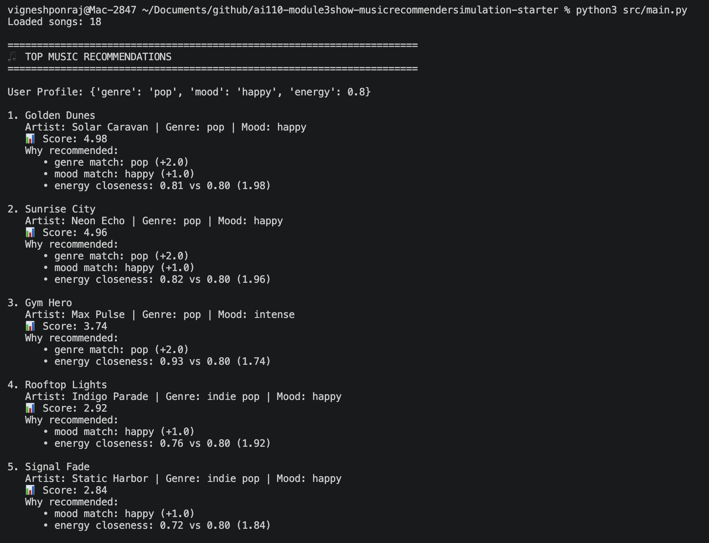
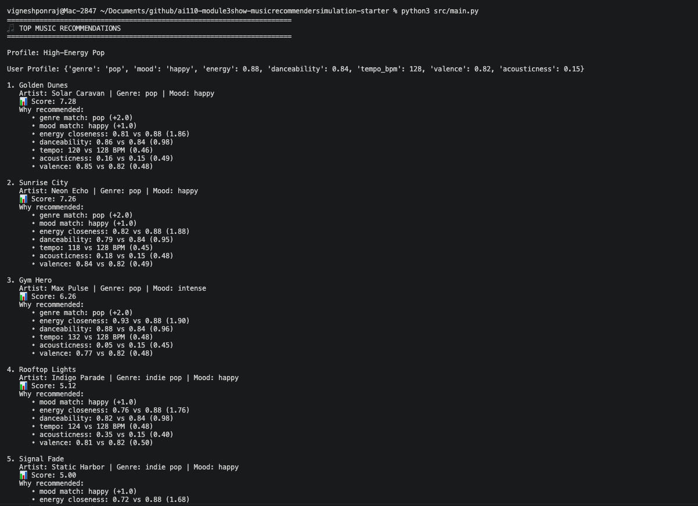
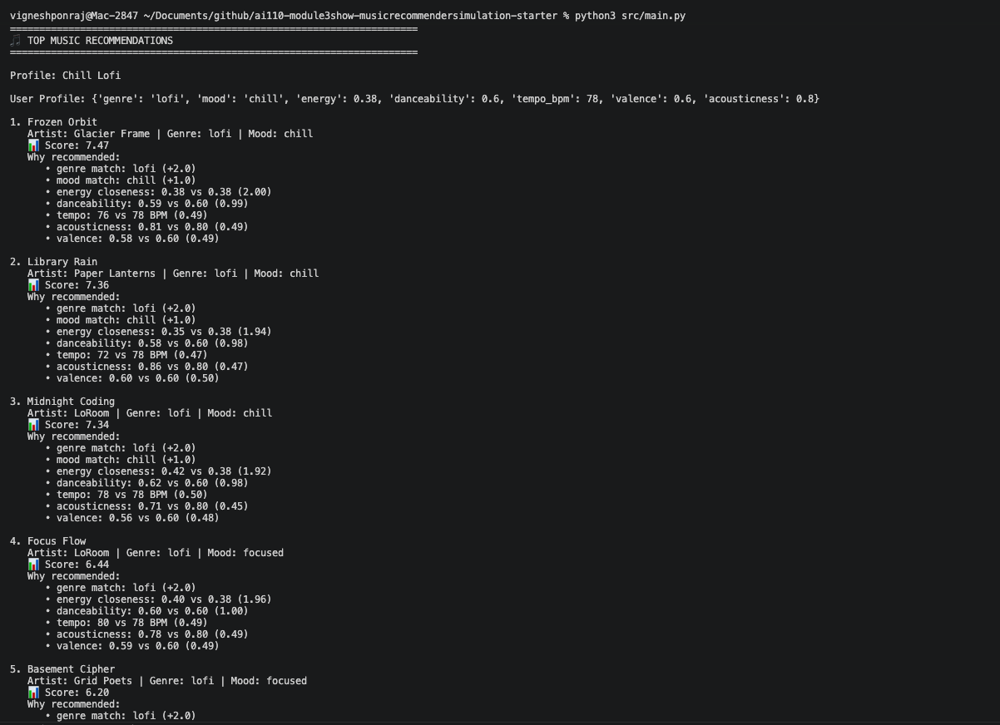
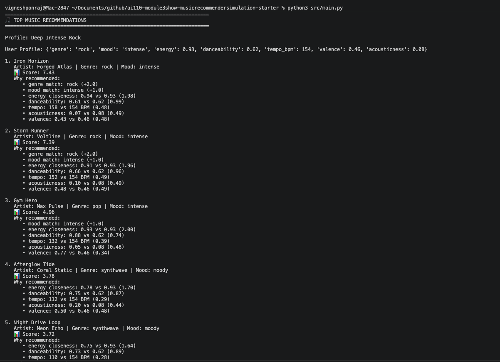
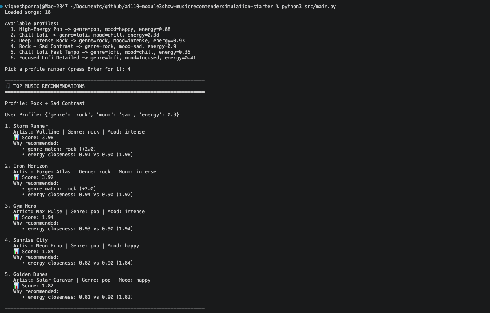
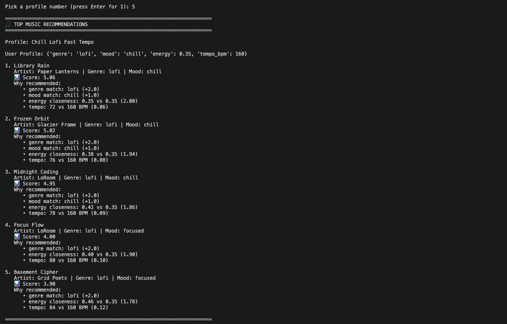
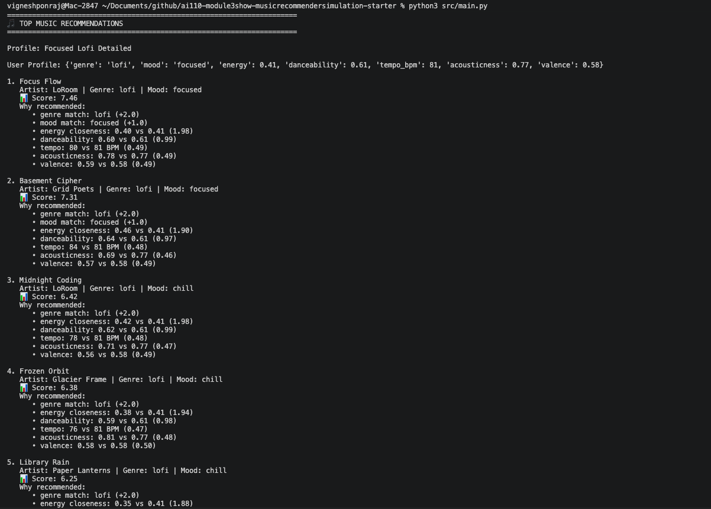

# 🎵 Music Recommender Simulation

## Project Summary

In this project you will build and explain a small music recommender system.

Your goal is to:

- Represent songs and a user "taste profile" as data
- Design a scoring rule that turns that data into recommendations
- Evaluate what your system gets right and wrong
- Reflect on how this mirrors real world AI recommenders

Replace this paragraph with your own summary of what your version does.

---

## How The System Works

Explain your design in plain language.

Some prompts to answer:

- What features does each `Song` use in your system
  - Each song is described by things like its genre, mood, energy, tempo, valence (how positive or cheerful it feels), danceability, and acousticness. These help the system understand what the song sounds and feels like.
- What information does your `UserProfile` store
  - The user profile stores what the listener likes, such as their favorite genre, favorite mood, target energy level, and whether they like acoustic music. In a richer version, it can also store preferred tempo, danceability, valence, and weights for each feature.
- How does your `Recommender` compute a score for each song
  - It compares each song to the user’s preferences. If the genre matches, the song gets extra points. If the mood matches, it gets more points. For features like energy and tempo, it gives higher points to songs that are closer to the user’s target, not just higher or lower. Then it adds everything up into one total score.
- How do you choose which songs to recommend
  - After every song gets a score, the system sorts all songs from highest score to lowest score. The top ones are the recommendations, because they best match the user’s taste.

Here's the flow diagram:


---

## Output



### Profile 1: High-Energy Pop



### Profile 2: Chill Lofi 



### Profile 3: Deep Intense Rock



### Profile 4: Rock + Sad Contrast



### Profile 5: Chill Lofi Fast Tempo



### Profile 6: Focused Lofi Detailed



---

## Getting Started

### Setup

1. Create a virtual environment (optional but recommended):

   ```bash
   python -m venv .venv
   source .venv/bin/activate      # Mac or Linux
   .venv\Scripts\activate         # Windows

2. Install dependencies

```bash
pip install -r requirements.txt
```

3. Run the app:

```bash
python -m src.main
```

### Running Tests

Run the starter tests with:

```bash
pytest
```

You can add more tests in `tests/test_recommender.py`.

---

## Experiments I Tried

- What happened when you changed the weight on genre from 2.0 to 0.5
  
  - Genre mattered much less. Energy and other numeric matches drove more of the ranking. Some songs from near genres moved up. The list felt broader, but sometimes less style-accurate.

- What happened when you added tempo or valence to the score

  - It improved tie-breaking between similar songs. Recommendations felt a bit more fine-tuned. The effect was smaller than genre, mood, or energy because these features had lower weights.

- How did your system behave for different types of users

  - Clear profiles like pop/happy and lofi/chill got strong, stable results. Conflicting profiles still got results, but they were less intuitive. Users with rare genre-mood combos had fewer good options. Extreme preferences were harder to satisfy when the catalog had no close songs.

---

## Limitations and Risks

The catalog is very small, so coverage is limited. Some genres and moods are underrepresented. Exact matching for genre and mood can be too strict. Feature weights can unintentionally favor some users over others. The model does not use lyrics, context, or user history over time.

---

## Reflection

Read and complete `model_card.md`:

[**Model Card**](model_card.md)

Write 1 to 2 paragraphs here about what you learned:

- about how recommenders turn data into predictions
- about where bias or unfairness could show up in systems like this


---

## 7. `model_card_template.md`

Combines reflection and model card framing from the Module 3 guidance. :contentReference[oaicite:2]{index=2}  

```markdown
# 🎧 Model Card - Music Recommender Simulation

## 1. Model Name

Give your recommender a name, for example:

> VibeMatch Mini

---

## 2. Intended Use

It suggests songs users will probably like from a small catalog. It compares their taste profile to each song. Then it ranks songs and shows the top matches. 

---

## 3. How It Works (Short Explanation)

The system compares each song to the user profile. It gives points for genre match and mood match. It gives more points when energy and other numeric features are close to the target. Then it adds all points and ranks songs from highest to lowest.

---

## 4. Data

We used a small dataset with 18 songs. Each song has genre, mood, energy, tempo, valence, danceability, and acousticness. It is useful for learning, but too small for real-world quality. Some genre-mood combinations are missing, so certain users get fewer good matches.

---

## 5. Strengths

- It works well for clear tastes like pop/happy or lofi/chill.
- It gives easy-to-understand reasons for each recommendation.
- It ranks songs consistently when preferences are similar.
- It responds clearly when we change weights, so behavior is transparent.
- It is simple to run and test in the CLI.
- It is good for learning how scoring and ranking work.

---

## 6. Limitations and Bias

The catalog is small, so some tastes have very few matches. Lofi and chill are overrepresented, so those users get better coverage. Exact matching for genre and mood can be too strict. Extreme preferences can be hard to satisfy if the dataset has no close songs. Some features, like acousticness, have low weight and may be underused.

---

## 7. Evaluation

- I ran the recommender with multiple user profiles. 
- Compared normal profiles and edge-case profiles. 
- Changed weights and feature rules to test sensitivity. 
- Checked whether top results and explanations matched the expectations.

---

## 8. Future Work

- Add more songs and more balanced genre-mood coverage. 
- Support partial similarity between related genres and moods instead of exact match only. 
- Let users set feature weights or learn weights from feedback over time.

---

## 9. Personal Reflection

A few sentences about what I learned:

- What surprised you about how your system behaved

  - Small scoring changes caused big ranking changes. Turning one feature on or off shifted the top songs quickly. Some results looked “right” even when the logic was very simple. Bias from the dataset showed up faster than expected.

- How did building this change how you think about real music recommenders

  - Real recommenders are not just “smart.” They are many design choices. Weights, data coverage, and feature selection matter a lot. Even simple models can shape what people keep hearing. So fairness and diversity checks are as important as accuracy.

- Where do you think human judgment still matters, even if the model seems "smart"

  - I still needed to double-check fairness claims, result quality, and naming/wording choices. I also needed to verify that changes matched my intent before keeping them.

